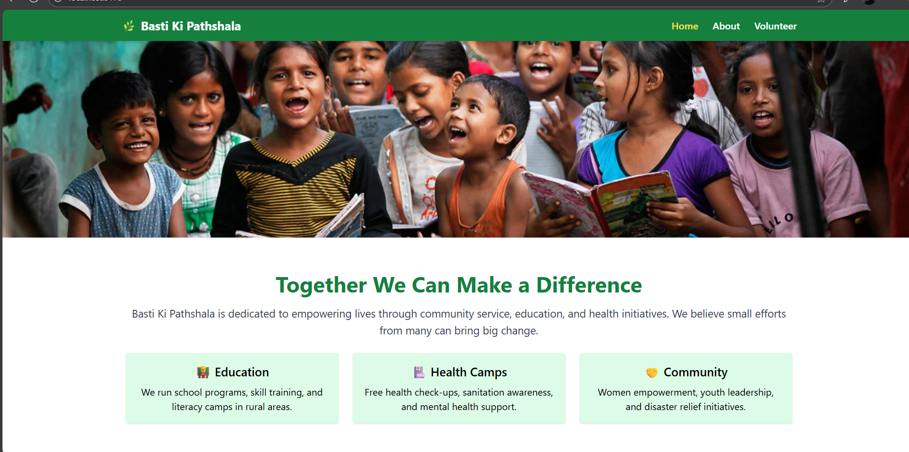
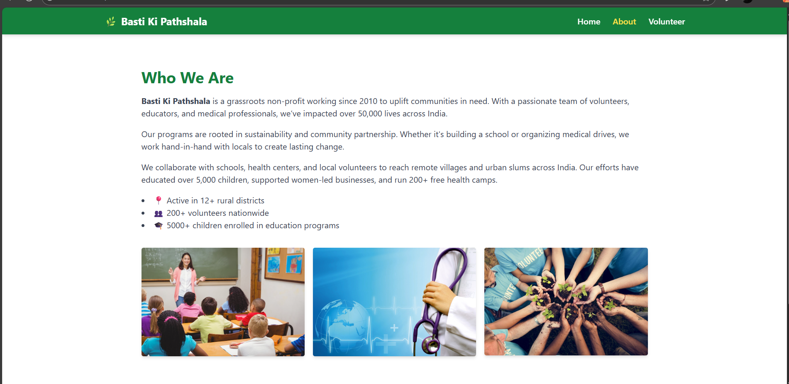
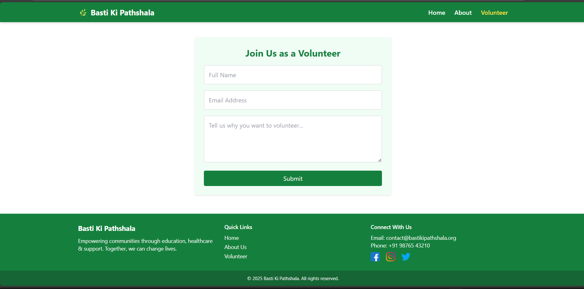

# 🌱 NGO Website – Built with React, Tailwind CSS, and Vite

A responsive, modern, and beginner-friendly NGO website that includes a **Home page**, an **About Us** section with images, and a **Volunteer Form**. Built using **React**, **Tailwind CSS**, and **Vite** for fast development and clean UI.

---

## 📸 Screenshots





---

## 🚀 Features

- ✅ Responsive design for all devices
- ✅ Mobile hamburger menu (green navbar retained)
- ✅ Full-width banner image
- ✅ About Us section with informative text & visuals
- ✅ Volunteer Form with proper layout and responsive input fields
- ✅ Sticky Footer
- ✅ Clean, maintainable code

---

## 🛠 Tech Stack

- ⚛️ React (with functional components)
- 🎨 Tailwind CSS (utility-first styling)
- ⚡ Vite (fast React build tool)

---

## 📁 Folder Structure

ngo-website/
│
│
├── src/
│ ├── assets/
│ │ ├── home.png
│ │ ├── about.png
│ │ └── volunteer.png
│ │
│ ├── components/
│ │ ├── Navbar.jsx
│ │ ├── Footer.jsx
│ │ ├── Home.jsx
│ │ ├── About.jsx
│ │ └── Volunteer.jsx
│ │
│ ├── App.jsx
│ └── main.jsx
│
├── .gitignore
├── tailwind.config.js
├── vite.config.js
├── package.json
└── README.md


---

## 📦 Getting Started

### 1. Clone the Repository

```bash
git clone https://github.com/sona-s29/Assignment.git
cd Assignment
